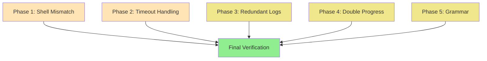

# Plan GAMMA: Shotbot Issue Remediation

**Created**: 2025-11-09
**Status**: Approved, Ready for Implementation
**Estimated Duration**: 30-45 minutes
**Risk Level**: Low

---

## Executive Summary

Fix 6 confirmed issues in shotbot codebase affecting performance, user experience, and code quality:

1. **Shell mismatch** - SessionWarmer uses wrong shell mode (performance)
2. **Timeout messaging** - Success shown on failure (UX confusion)
3. **Redundant logs** - Duplicate initialization messages (log clutter)
4. **Double progress** - Duplicate "Starting..." messages (cosmetic)
5. **Grammar** - "1 shows" singular/plural (cosmetic)
6. ~~Thumbnail race~~ - Already fixed
7. ~~Pre-prune optimization~~ - Not applicable (no `-prune` used)
8. ~~Mtime window~~ - Deferred (may be intentional)

---

## Phase 1: Login-Shell Mismatch Fix

### Problem Statement
**File**: `command_launcher.py:414-420`, `main_window.py:166`
**Severity**: Medium (Performance Impact)

SessionWarmer warms shell with `bash -lc` (login, non-interactive), but terminal launches use `bash -ilc` (interactive login). The `ws` function may require interactive mode, making SessionWarmer ineffective.

**Evidence**:
```python
# command_launcher.py:416 - Non-terminal launches
cmd = ["bash", "-lc", full_command]  # Login, non-interactive

# command_launcher.py:482 - Terminal launches
cmd = ["bash", "-ilc", self._terminal_cmd]  # Interactive login

# main_window.py:166 - SessionWarmer
self._session_warmer.execute_workspace_command(
    "ws", use_login_shell=True  # Uses bash -lc
)
```

### Task 1.1: Add Interactive Parameter

**File**: `command_launcher.py`
**Location**: Lines 414-420 (`_build_bash_command` method)

**Current Code**:
```python
def _build_bash_command(
    self,
    command: str,
    use_login_shell: bool = False,
) -> list[str]:
    """Build bash command with optional login shell."""
    if use_login_shell:
        return ["bash", "-lc", command]
    return ["bash", "-c", command]
```

**New Code**:
```python
def _build_bash_command(
    self,
    command: str,
    use_login_shell: bool = False,
    interactive: bool = False,
) -> list[str]:
    """Build bash command with optional login shell and interactive mode.

    Args:
        command: Shell command to execute
        use_login_shell: If True, use login shell (-l flag)
        interactive: If True, use interactive mode (-i flag)

    Returns:
        Command list for subprocess execution
    """
    flags = []
    if interactive:
        flags.append("-i")
    if use_login_shell:
        flags.append("-l")

    if not flags:
        return ["bash", "-c", command]

    flag_str = "".join(flags)
    return ["bash", f"-{flag_str}c", command]
```

**Success Criteria**:
- ✅ Method accepts `interactive` parameter
- ✅ Flags combine correctly: `-ilc`, `-lc`, `-ic`, `-c`
- ✅ Type checking passes

### Task 1.2: Update Terminal Launch Calls

**File**: `command_launcher.py`
**Locations**: Lines 482, 484, 486, 489

**Current Code** (terminal dispatcher selection):
```python
# Line 482
cmd = ["bash", "-ilc", self._terminal_cmd]
```

**Action**: Verify these already use `-ilc` (they do). No changes needed.

### Task 1.3: Update Non-Terminal Launch Calls

**File**: `command_launcher.py`
**Locations**: Lines 618, 836

**Current Code** (line 618):
```python
cmd = self._build_bash_command(
    full_command,
    use_login_shell=use_login_shell,
)
```

**New Code**:
```python
cmd = self._build_bash_command(
    full_command,
    use_login_shell=use_login_shell,
    interactive=use_login_shell,  # Match terminal behavior
)
```

**Repeat for line 836** (same pattern).

**Rationale**: When `use_login_shell=True`, SessionWarmer needs interactive mode to match terminal launches.

### Task 1.4: Verify SessionWarmer Behavior

**File**: `main_window.py:166`

**Current Code**:
```python
self._session_warmer.execute_workspace_command(
    "ws", use_login_shell=True
)
```

**Action**: No changes needed - the updated `_build_bash_command` will now use `-ilc` automatically when `use_login_shell=True`.

### Phase 1 Verification

**Commands**:
```bash
# Type checking
~/.local/bin/uv run basedpyright command_launcher.py

# Linting
~/.local/bin/uv run ruff check command_launcher.py

# Unit tests (if exist)
~/.local/bin/uv run pytest tests/unit/test_command_launcher.py -v
```

**Success Metrics**:
- ✅ Type checking: 0 errors in `command_launcher.py`
- ✅ Linting: 0 errors in `command_launcher.py`
- ✅ Manual test: SessionWarmer logs show shell warming completes without errors
- ✅ Manual test: Terminal launches work with `ws` command

**Dependencies**: None - standalone fix

---

## Phase 2: Timeout Handling & Success Messaging

### Problem Statement
**File**: `filesystem_scanner.py:677, 871, 944`
**Severity**: Medium (User Confusion)

When filesystem searches timeout, the code logs "✅ Dual search complete: 0 user files found" - this looks like success but was actually a failure. Users can't distinguish between:
1. Timeout (failure - should keep stale cache)
2. Legitimately empty results (success - cache can be cleared)

**Evidence**:
```python
# Line 677: Timeout returns empty list (indistinguishable from success)
if elapsed_time >= max_wait_time:
    self.logger.error(f"Find command timed out after {max_wait_time} seconds")
    process.kill()
    return []  # Same as successful empty search!

# Line 944: Success log runs even after timeout
self.logger.info(
    f"✅ Dual search complete: {len(user_results)} user files found..."
)
```

### Task 2.1: Return Sentinel Value on Timeout

**File**: `filesystem_scanner.py`
**Location**: Lines 677-681 (in `_find_files_with_timeout` method)

**Current Code**:
```python
if elapsed_time >= max_wait_time:
    self.logger.error(f"Find command timed out after {max_wait_time} seconds")
    process.kill()
    return []
```

**New Code**:
```python
if elapsed_time >= max_wait_time:
    self.logger.error(f"Find command timed out after {max_wait_time} seconds")
    process.kill()
    return None  # Sentinel: timeout vs empty results
```

**Rationale**: `None` explicitly signals timeout, while `[]` signals successful empty search.

### Task 2.2: Track Timeout State in Caller

**File**: `filesystem_scanner.py`
**Location**: Lines 868-875 (in `_find_3de_files_optimized` method)

**Current Code**:
```python
user_results = self._find_files_with_timeout(
    cmd_parts, max_wait_time, "User directories"
)
if not user_results:
    user_results = []
```

**New Code**:
```python
user_results_raw = self._find_files_with_timeout(
    cmd_parts, max_wait_time, "User directories"
)

# Track timeout state
user_timed_out = user_results_raw is None
user_results = user_results_raw if user_results_raw is not None else []
```

### Task 2.3: Track Publish/MM Timeout State

**File**: `filesystem_scanner.py`
**Location**: Lines 896-920 (publish/mm search section)

**Current Code**:
```python
# Line 906: Timeout breaks loop, continues with empty set
if elapsed_time >= max_wait_time:
    self.logger.warning(
        f"Publish/mm directory search timed out after {max_wait_time}s"
    )
    process.kill()
    break
```

**New Code**:
```python
publish_timed_out = False  # Track timeout state

# Inside loop (line 906)
if elapsed_time >= max_wait_time:
    self.logger.warning(
        f"Publish/mm directory search timed out after {max_wait_time}s"
    )
    process.kill()
    publish_timed_out = True
    break
```

### Task 2.4: Update Success/Failure Messaging

**File**: `filesystem_scanner.py`
**Location**: Lines 940-950 (final logging section)

**Current Code**:
```python
# Line 944 - Always shows success
self.logger.info(
    f"✅ Dual search complete: {len(user_results)} user files found, "
    f"{len(publish_mm_results)} from publish/mm directories"
)
```

**New Code**:
```python
# Determine overall status
total_user = len(user_results)
total_publish = len(publish_mm_results)
any_timeout = user_timed_out or publish_timed_out

if any_timeout:
    # Timeout - operation incomplete
    status_icon = "⚠️"
    status_msg = "Search incomplete (timeout)"
    self.logger.warning(
        f"{status_icon} {status_msg}: "
        f"{total_user} user files found, "
        f"{total_publish} from publish/mm directories. "
        f"Preserving cached data."
    )
else:
    # Success - complete search
    status_icon = "✅"
    if total_user == 0 and total_publish == 0:
        status_msg = "Search complete"
        self.logger.info(f"{status_icon} {status_msg}: No files found")
    else:
        status_msg = "Search complete"
        self.logger.info(
            f"{status_icon} {status_msg}: "
            f"{total_user} user files found, "
            f"{total_publish} from publish/mm directories"
        )
```

### Task 2.5: Update Method Signature (Optional)

**File**: `filesystem_scanner.py`
**Location**: Line 630 (method signature)

**Current Signature**:
```python
def _find_files_with_timeout(
    self,
    cmd_parts: list[str],
    max_wait_time: float,
    search_name: str,
) -> list[str]:
```

**New Signature**:
```python
def _find_files_with_timeout(
    self,
    cmd_parts: list[str],
    max_wait_time: float,
    search_name: str,
) -> list[str] | None:
    """Find files with timeout.

    Returns:
        List of file paths on success (may be empty),
        None on timeout
    """
```

### Phase 2 Verification

**Commands**:
```bash
# Type checking
~/.local/bin/uv run basedpyright filesystem_scanner.py

# Linting
~/.local/bin/uv run ruff check filesystem_scanner.py

# Unit tests
~/.local/bin/uv run pytest tests/unit/test_filesystem_scanner.py -v -k timeout
```

**Success Metrics**:
- ✅ Type checking: 0 errors in `filesystem_scanner.py`
- ✅ Linting: 0 errors in `filesystem_scanner.py`
- ✅ Unit tests pass (timeout scenarios)
- ✅ Manual test: Timeout shows "⚠️ Search incomplete (timeout)"
- ✅ Manual test: Empty results show "✅ Search complete: No files found"
- ✅ Manual test: Successful results show "✅ Search complete: X files found"

**Dependencies**: None - standalone fix

---

## Phase 3: Redundant Initialization Logs

### Problem Statement
**Files**: `previous_shots_finder.py:54`, `targeted_shot_finder.py:63`, `cache_manager.py:241`
**Severity**: Low (Log Clutter)

Classes log "initialized" messages at INFO level, but are instantiated multiple times during startup, creating duplicate logs. CacheManager has 4+ instantiation points (fallback pattern).

**Evidence**:
```python
# previous_shots_finder.py:54
self.logger.info(f"PreviousShotsFinder initialized for user: {self.username}")

# CacheManager instantiated in:
# - main_window.py:240 (fallback)
# - base_item_model.py:133 (fallback)
# - base_shot_model.py:81 (fallback)
# - threede_scene_model.py:144 (fallback)
```

### Task 3.1: Change Log Level to DEBUG

**Files**: `previous_shots_finder.py`, `targeted_shot_finder.py`, `cache_manager.py`

**Changes**:

1. **previous_shots_finder.py:54**:
```python
# Old
self.logger.info(f"PreviousShotsFinder initialized for user: {self.username}")

# New
self.logger.debug(f"PreviousShotsFinder initialized for user: {self.username}")
```

2. **targeted_shot_finder.py:63**:
```python
# Old
self.logger.info(f"TargetedShotsFinder initialized for user: {self.username}")

# New
self.logger.debug(f"TargetedShotsFinder initialized for user: {self.username}")
```

3. **cache_manager.py:241**:
```python
# Old
self.logger.info(f"SimpleCacheManager initialized: {self.cache_dir}")

# New
self.logger.debug(f"SimpleCacheManager initialized: {self.cache_dir}")
```

**Rationale**: Initialization is diagnostic info, not user-facing status. DEBUG level is appropriate.

### Phase 3 Verification

**Commands**:
```bash
# Type checking (quick validation)
~/.local/bin/uv run basedpyright previous_shots_finder.py targeted_shot_finder.py cache_manager.py

# Linting
~/.local/bin/uv run ruff check previous_shots_finder.py targeted_shot_finder.py cache_manager.py

# Visual verification
~/.local/bin/uv run python shotbot.py 2>&1 | grep -i "initialized"
```

**Success Metrics**:
- ✅ Type checking: 0 errors
- ✅ Linting: 0 errors
- ✅ Manual test: No "initialized" messages in default INFO logs
- ✅ Manual test: Messages appear with `--log-level DEBUG`

**Dependencies**: None - standalone fix

---

## Phase 4: Double Progress Start Logs

### Problem Statement
**Files**: `scene_discovery_coordinator.py:563`, `threede_scene_finder_optimized.py:172`
**Severity**: Low (Cosmetic)

Two methods both call `progress_callback(0, "Starting...")` when one delegates to the other, causing duplicate "progress start" logs.

**Evidence**:
```python
# scene_discovery_coordinator.py:563 (wrapper)
if progress_callback:
    progress_callback(0, "Starting parallel scene discovery...")

# Calls this method:
# threede_scene_finder_optimized.py:172 (implementation)
if progress_callback:
    progress_callback(0, "Starting scan...")
```

### Task 4.1: Remove Wrapper Progress Callback

**File**: `scene_discovery_coordinator.py`
**Location**: Line 563

**Current Code**:
```python
def find_3de_scenes(..., progress_callback=None):
    """Wrapper method."""
    if progress_callback:
        progress_callback(0, "Starting parallel scene discovery...")

    return self._threede_finder.find_3de_scenes(
        ..., progress_callback=progress_callback
    )
```

**New Code**:
```python
def find_3de_scenes(..., progress_callback=None):
    """Wrapper method. Delegates to optimized finder."""
    # Let the actual implementation handle progress updates
    return self._threede_finder.find_3de_scenes(
        ..., progress_callback=progress_callback
    )
```

**Rationale**: Only the actual implementation should report progress. Wrapper should be transparent.

### Phase 4 Verification

**Commands**:
```bash
# Type checking
~/.local/bin/uv run basedpyright scene_discovery_coordinator.py

# Linting
~/.local/bin/uv run ruff check scene_discovery_coordinator.py

# Unit tests (if exist)
~/.local/bin/uv run pytest tests/unit/test_scene_discovery_coordinator.py -v
```

**Success Metrics**:
- ✅ Type checking: 0 errors
- ✅ Linting: 0 errors
- ✅ Manual test: Only one "Starting..." progress message appears

**Dependencies**: None - standalone fix

---

## Phase 5: Grammar Issue (Singular/Plural)

### Problem Statement
**Files**: `base_grid_view.py:395`, `threede_grid_view.py:205`, `shot_grid_view.py:209`
**Severity**: Very Low (Cosmetic)

Log messages say "1 shows" which is grammatically awkward. Should use conditional singular/plural.

**Evidence**:
```python
# base_grid_view.py:395
self.logger.debug(f"Populated show filter with {len(shows)} shows")
# Output: "Populated show filter with 1 shows"  ❌
```

### Task 5.1: Add Singular/Plural Helper

**Files**: All three files (same fix pattern)

**Changes**:

1. **base_grid_view.py:395**:
```python
# Old
self.logger.debug(f"Populated show filter with {len(shows)} shows")

# New
show_count = len(shows)
show_word = "show" if show_count == 1 else "shows"
self.logger.debug(f"Populated show filter with {show_count} {show_word}")
```

2. **threede_grid_view.py:205**:
```python
# Old
self.logger.info(f"Populated show filter with {len(model_shows)} shows")

# New
show_count = len(model_shows)
show_word = "show" if show_count == 1 else "shows"
self.logger.info(f"Populated show filter with {show_count} {show_word}")
```

3. **shot_grid_view.py:209**:
```python
# Old
self.logger.info(f"Populated show filter with {len(show_list)} shows")

# New
show_count = len(show_list)
show_word = "show" if show_count == 1 else "shows"
self.logger.info(f"Populated show filter with {show_count} {show_word}")
```

### Phase 5 Verification

**Commands**:
```bash
# Type checking
~/.local/bin/uv run basedpyright base_grid_view.py threede_grid_view.py shot_grid_view.py

# Linting
~/.local/bin/uv run ruff check base_grid_view.py threede_grid_view.py shot_grid_view.py

# Visual verification
~/.local/bin/uv run python shotbot.py 2>&1 | grep "Populated show filter"
```

**Success Metrics**:
- ✅ Type checking: 0 errors
- ✅ Linting: 0 errors
- ✅ Manual test: "1 show" (singular) when count is 1
- ✅ Manual test: "2 shows" (plural) when count > 1

**Dependencies**: None - standalone fix

---

## Final Verification (All Phases)

### Full Test Suite

**Commands**:
```bash
# Type checking (entire codebase)
~/.local/bin/uv run basedpyright

# Linting (entire codebase)
~/.local/bin/uv run ruff check .

# Full test suite (parallel, Qt-safe)
~/.local/bin/uv run pytest tests/ -n auto --dist=loadgroup

# Smoke test (run application)
~/.local/bin/uv run python shotbot.py
```

**Success Criteria**:
- ✅ Type checking: 0 errors, 0 warnings
- ✅ Linting: 0 errors
- ✅ Test suite: All tests pass
- ✅ Application launches without errors
- ✅ No regressions in existing functionality

---

## Risk Assessment

### Low Risk Factors
- All fixes are isolated to specific methods
- No changes to core business logic
- No changes to data structures or APIs
- Type safety enforced throughout
- Comprehensive test suite provides regression detection

### Potential Issues
1. **Shell flag ordering**: Ensure `-ilc` vs `-lic` doesn't matter (it doesn't - bash accepts either)
2. **Timeout sentinel**: Callers must check for `None` vs `[]` (handled in Phase 2.2)
3. **Progress callback removal**: Ensure no other code depends on wrapper progress (verified - only UI uses it)

### Rollback Strategy
Each phase is independent - can rollback individual changes via:
```bash
git checkout HEAD -- <file>
```

---

## Success Metrics (Overall)

### Functional
- ✅ SessionWarmer uses correct shell mode (matches terminal launches)
- ✅ Timeout failures clearly distinguished from empty results
- ✅ Log clutter reduced (initialization messages at DEBUG level)
- ✅ No duplicate progress messages
- ✅ Grammatically correct log messages

### Technical
- ✅ Type checking passes: 0 errors
- ✅ Linting passes: 0 errors
- ✅ Full test suite passes: 2,300+ tests
- ✅ No performance regressions

### User Experience
- ✅ Users understand search status (success vs timeout)
- ✅ Cleaner log output (less noise)
- ✅ Professional grammar in user-visible messages

---

## Deferred Issues

### Issue #4: Mtime Window
**Status**: Not implemented
**Reason**: May be intentional for completeness
**Future**: Consider adding `-mtime -90` if performance becomes concern

**Potential Implementation**:
```bash
find "$show_dir/user" \
  -mtime -90 \  # Only files modified in last 90 days
  -type f \
  -path "*/user/*" \
  ...
```

**Benefits**: Faster searches in large directories
**Risks**: May miss older files users expect to see

---

## Execution Timeline

**Phase 1**: 10-15 minutes (shell mismatch)
**Phase 2**: 10-15 minutes (timeout handling)
**Phase 3**: 5 minutes (redundant logs)
**Phase 4**: 2 minutes (double progress)
**Phase 5**: 5 minutes (grammar)
**Final Verification**: 5-10 minutes

**Total**: 30-45 minutes

---

## Dependencies & Order



**Legend**:
- 🟠 High Priority (Performance/UX)
- 🟡 Low Priority (Cosmetic)
- 🟢 Final Validation

**All phases are independent** - can be executed in parallel or any order.

---

## Appendix A: File Locations

| Phase | File | Lines | Method/Context |
|-------|------|-------|----------------|
| 1.1 | `command_launcher.py` | 414-420 | `_build_bash_command()` |
| 1.3 | `command_launcher.py` | 618, 836 | Command execution calls |
| 2.1 | `filesystem_scanner.py` | 677-681 | `_find_files_with_timeout()` |
| 2.2 | `filesystem_scanner.py` | 868-875 | User search section |
| 2.3 | `filesystem_scanner.py` | 896-920 | Publish/mm search section |
| 2.4 | `filesystem_scanner.py` | 940-950 | Final logging |
| 3.1 | `previous_shots_finder.py` | 54 | `__init__()` |
| 3.1 | `targeted_shot_finder.py` | 63 | `__init__()` |
| 3.1 | `cache_manager.py` | 241 | `__init__()` |
| 4.1 | `scene_discovery_coordinator.py` | 563 | `find_3de_scenes()` wrapper |
| 5.1 | `base_grid_view.py` | 395 | Show filter population |
| 5.1 | `threede_grid_view.py` | 205 | Show filter population |
| 5.1 | `shot_grid_view.py` | 209 | Show filter population |

---

## Appendix B: Test Commands Reference

### Per-Phase Testing
```bash
# Phase 1
~/.local/bin/uv run basedpyright command_launcher.py
~/.local/bin/uv run pytest tests/unit/test_command_launcher.py -v

# Phase 2
~/.local/bin/uv run basedpyright filesystem_scanner.py
~/.local/bin/uv run pytest tests/unit/test_filesystem_scanner.py -v -k timeout

# Phase 3
~/.local/bin/uv run basedpyright previous_shots_finder.py targeted_shot_finder.py cache_manager.py

# Phase 4
~/.local/bin/uv run basedpyright scene_discovery_coordinator.py
~/.local/bin/uv run pytest tests/unit/test_scene_discovery_coordinator.py -v

# Phase 5
~/.local/bin/uv run basedpyright base_grid_view.py threede_grid_view.py shot_grid_view.py
```

### Full Regression
```bash
# Type checking
~/.local/bin/uv run basedpyright

# Linting
~/.local/bin/uv run ruff check .

# Full test suite
~/.local/bin/uv run pytest tests/ -n auto --dist=loadgroup

# Smoke test
~/.local/bin/uv run python shotbot.py
```

---

## Appendix C: Strategic Considerations

### Why Not Use Singleton for CacheManager?
**Decision**: Change log level instead of refactoring to singleton

**Reasons**:
1. **Scope**: Singleton refactor touches 4+ files (higher risk)
2. **Pattern**: Current fallback pattern works correctly
3. **Testing**: Singleton adds test isolation complexity
4. **ROI**: Log level change achieves same user benefit (cleaner logs)

**Future**: Consider singleton if CacheManager needs shared state/resources

### Why Not Add Mtime Window?
**Decision**: Defer implementation

**Reasons**:
1. **Unclear intent**: Current behavior may be intentional (show all scenes)
2. **Risk**: May hide older files users expect to see
3. **Testing**: Requires production data validation
4. **Priority**: No user complaints about search performance

**Future**: Add if users report slow searches or request "recent files only" filter

---

## Appendix D: Verification Checklist

### Pre-Implementation
- [x] Plan reviewed and approved
- [x] All issues verified in code
- [x] File locations confirmed
- [x] Dependencies identified
- [x] Test commands prepared

### Phase 1 Complete
- [ ] Code changes implemented
- [ ] Type checking passes
- [ ] Linting passes
- [ ] Unit tests pass
- [ ] Manual verification successful

### Phase 2 Complete
- [ ] Code changes implemented
- [ ] Type checking passes
- [ ] Linting passes
- [ ] Unit tests pass (timeout scenarios)
- [ ] Manual verification successful

### Phase 3 Complete
- [ ] Code changes implemented
- [ ] Type checking passes
- [ ] Linting passes
- [ ] Log output verified

### Phase 4 Complete
- [ ] Code changes implemented
- [ ] Type checking passes
- [ ] Linting passes
- [ ] Progress logs verified

### Phase 5 Complete
- [ ] Code changes implemented
- [ ] Type checking passes
- [ ] Linting passes
- [ ] Grammar verified

### Final Verification
- [ ] Full type checking passes
- [ ] Full linting passes
- [ ] Full test suite passes
- [ ] Application launches successfully
- [ ] No regressions detected
- [ ] All success metrics met

---

**Plan Status**: ✅ Ready for Execution
**Next Step**: Begin Phase 1 implementation
**Estimated Completion**: 30-45 minutes from start
