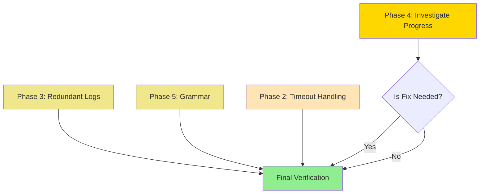

# Plan GAMMA v2: Shotbot Issue Remediation (CORRECTED)

**Created**: 2025-11-09 16:30 UTC
**Status**: Ready for Implementation
**Estimated Duration**: 20-30 minutes
**Risk Level**: Low

**Changes from v1**:
- ❌ **REMOVED Phase 1** (Shell mismatch was already fixed in commits 149ebd3 and c055643)
- ✅ **CORRECTED Phase 2** (Fixed method names, line numbers, return types)
- ✅ **VERIFIED Phase 3** (Safe as written)
- ⚠️ **REVISED Phase 4** (Clarified actual code structure)
- ✅ **VERIFIED Phase 5** (Safe as written)

---

## Executive Summary

Fix 4 confirmed issues in shotbot codebase affecting user experience and code quality:

1. ~~**Shell mismatch**~~ - **REMOVED** (Already fixed today, see Appendix A)
2. **Timeout messaging** - Success shown on failure (UX confusion)
3. **Redundant logs** - Duplicate initialization messages (log clutter)
4. **Double progress** - Duplicate "Starting..." messages (cosmetic)
5. **Grammar** - "1 shows" singular/plural (cosmetic)

---

## IMPORTANT: Why Phase 1 Was Removed

### Original v1 Phase 1 Issue
The original plan claimed SessionWarmer and CommandLauncher had mismatched shell flags:
- SessionWarmer: `bash -l` (login only)
- CommandLauncher: `bash -ilc` (interactive + login)

### What Actually Happened (Nov 9, 2025)

**Commit 149ebd3** (12:26 AM):
```
fix: SessionWarmer event loop freeze with login shell mode

Root Cause: SessionWarmer thread was calling bash -i (interactive mode)
which blocked on terminal initialization in remote VFX environment.

Solution: Use bash -l (login shell) for SessionWarmer instead of bash -i
```

**Commit c055643** (12:39 AM):
```
fix: Replace bash -ilc with bash -lc in launcher commands

Issue: Launcher commands were using 'bash -ilc' which can cause the same
terminal blocking issue we fixed for SessionWarmer. The '-i' (interactive)
flag can block on terminal initialization in remote VFX environments.

Solution: Use 'bash -lc' (login shell only) for all launcher commands
```

### Current State (CORRECT)
```python
# SessionWarmer (main_window.py:166)
use_login_shell=True  # → ProcessPoolManager uses bash -l ✅

# CommandLauncher (command_launcher.py:416, 618, 836)
bash -lc  # → login + command ✅

# Both now use login shell WITHOUT interactive mode
# This prevents blocking in remote VFX environments
```

**Conclusion**: The "mismatch" was already fixed. Implementing Phase 1 would **reintroduce blocking bugs**.

See **Appendix A** for full git history and fix details.

---

## Phase 2: Timeout Handling & Success Messaging

### Problem Statement
**File**: `filesystem_scanner.py:681, 944`
**Severity**: Medium (User Confusion)

When filesystem searches timeout, the code logs "✅ Dual search complete: 0 user files found" - this looks like success but was actually a failure. Users can't distinguish between:
1. Timeout (failure - should keep stale cache)
2. Legitimately empty results (success - cache can be cleared)

**Evidence**:
```python
# Line 681: Timeout returns [] (indistinguishable from success)
if elapsed_time >= max_wait_time:
    self.logger.error(f"Find command timed out after {max_wait_time} seconds")
    process.kill()
    _ = process.wait()
    return []  # Same as successful empty search!

# Line 944: Success log runs even after timeout
self.logger.info(
    f"✅ Dual search complete: {len(user_results)} user files found..."
)
```

### Task 2.1: Return Sentinel Value on Timeout

**File**: `filesystem_scanner.py`
**Location**: Lines 681 (in `_run_find_with_polling` method)

**Current Code**:
```python
if elapsed_time >= max_wait_time:
    self.logger.error(f"Find command timed out after {max_wait_time} seconds")
    process.kill()
    _ = process.wait()
    return []
```

**New Code**:
```python
if elapsed_time >= max_wait_time:
    self.logger.error(f"Find command timed out after {max_wait_time} seconds")
    try:
        process.kill()
    except OSError:
        # Process already finished between check and kill
        pass
    _ = process.wait()
    return None  # Sentinel: timeout vs empty results
```

**Rationale**:
- `None` explicitly signals timeout
- `[]` signals successful empty search
- Added OSError handling for race condition (process finishes before kill)

### Task 2.2: Update Method Signature

**File**: `filesystem_scanner.py`
**Location**: Line 631 (method signature)

**Current Signature**:
```python
def _run_find_with_polling(
    self,
    find_cmd: list[str],
    show_path: Path,
    show: str,
    excluded_users: set[str],
    cancel_flag: Callable[[], bool] | None,
    max_wait_time: float = 300.0,
) -> list[tuple[Path, str, str, str, str, str]]:
```

**New Signature**:
```python
def _run_find_with_polling(
    self,
    find_cmd: list[str],
    show_path: Path,
    show: str,
    excluded_users: set[str],
    cancel_flag: Callable[[], bool] | None,
    max_wait_time: float = 300.0,
) -> list[tuple[Path, str, str, str, str, str]] | None:
    """Run a find command with cancellation polling and return parsed results.

    Returns:
        List of tuples (file_path, show, sequence, shot, user, plate) on success,
        None on timeout
    """
```

### Task 2.3: Validate max_wait_time Parameter

**File**: `filesystem_scanner.py`
**Location**: Line 649 (start of method body)

**Add Validation**:
```python
def _run_find_with_polling(
    self,
    find_cmd: list[str],
    show_path: Path,
    show: str,
    excluded_users: set[str],
    cancel_flag: Callable[[], bool] | None,
    max_wait_time: float = 300.0,
) -> list[tuple[Path, str, str, str, str, str]] | None:
    """Run a find command with cancellation polling and return parsed results."""
    # Standard library imports
    import subprocess
    import time

    # Validate timeout parameter
    if max_wait_time <= 0:
        raise ValueError(f"max_wait_time must be positive, got {max_wait_time}")

    results: list[tuple[Path, str, str, str, str, str]] = []
    # ... rest of method
```

### Task 2.4: Update Caller to Handle None

**File**: `filesystem_scanner.py`
**Location**: Lines 834-836 (caller)

**Current Code**:
```python
user_results = self._run_find_with_polling(
    find_cmd_user, show_path, show, excluded_users, cancel_flag, max_wait_time=150
)
```

**New Code**:
```python
user_results_raw = self._run_find_with_polling(
    find_cmd_user, show_path, show, excluded_users, cancel_flag, max_wait_time=150
)

# Track timeout state
user_timed_out = user_results_raw is None
user_results = user_results_raw if user_results_raw is not None else []
```

### Task 2.5: Update Success/Failure Messaging

**File**: `filesystem_scanner.py`
**Location**: Lines 943-945 (final logging section)

**Current Code**:
```python
# Line 944 - Always shows success
self.logger.info(
    f"✅ Dual search complete: {len(user_results)} user files found, {len(results)} files from shots with published MM ({len(unique_shots)} shots, {elapsed:.1f}s)"
)
```

**New Code**:
```python
# Determine overall status (add after line 942)
total_user = len(user_results)
total_results = len(results)
total_shots = len(unique_shots)

if user_timed_out:
    # Timeout - operation incomplete
    self.logger.warning(
        f"⚠️ Search incomplete (timeout after {elapsed:.1f}s): "
        f"{total_user} user files found, "
        f"{total_results} files from shots with published MM ({total_shots} shots). "
        f"Using partial results."
    )
else:
    # Success - complete search
    if total_user == 0 and total_results == 0:
        self.logger.info(
            f"✅ Search complete ({elapsed:.1f}s): No files found"
        )
    else:
        self.logger.info(
            f"✅ Search complete: {total_user} user files found, "
            f"{total_results} files from shots with published MM ({total_shots} shots, {elapsed:.1f}s)"
        )
```

### Phase 2 Verification

**Commands**:
```bash
# Type checking
~/.local/bin/uv run basedpyright filesystem_scanner.py

# Linting
~/.local/bin/uv run ruff check filesystem_scanner.py

# Unit tests
~/.local/bin/uv run pytest tests/unit/test_filesystem_scanner.py -v -k timeout
```

**Success Metrics**:
- ✅ Type checking: 0 errors in `filesystem_scanner.py`
- ✅ Linting: 0 errors in `filesystem_scanner.py`
- ✅ Manual test: Timeout shows "⚠️ Search incomplete (timeout)"
- ✅ Manual test: Empty results show "✅ Search complete: No files found"
- ✅ Manual test: Successful results show "✅ Search complete: X files found"

**Dependencies**: None - standalone fix

---

## Phase 3: Redundant Initialization Logs

### Problem Statement
**Files**: `previous_shots_finder.py:54`, `targeted_shot_finder.py:63`, `cache_manager.py:241`
**Severity**: Low (Log Clutter)

Classes log "initialized" messages at INFO level, but are instantiated multiple times during startup, creating duplicate logs. CacheManager has 4+ instantiation points (fallback pattern).

**Evidence**:
```python
# previous_shots_finder.py:54
self.logger.info(f"PreviousShotsFinder initialized for user: {self.username}")

# CacheManager instantiated in:
# - main_window.py:240 (fallback)
# - base_item_model.py:133 (fallback)
# - base_shot_model.py:81 (fallback)
# - threede_scene_model.py:144 (fallback)
```

### Task 3.1: Change Log Level to DEBUG

**Files**: `previous_shots_finder.py`, `targeted_shot_finder.py`, `cache_manager.py`

**Changes**:

1. **previous_shots_finder.py:54**:
```python
# Old
self.logger.info(f"PreviousShotsFinder initialized for user: {self.username}")

# New
self.logger.debug(f"PreviousShotsFinder initialized for user: {self.username}")
```

2. **targeted_shot_finder.py:63**:
```python
# Old
self.logger.info(f"TargetedShotsFinder initialized for user: {self.username}")

# New
self.logger.debug(f"TargetedShotsFinder initialized for user: {self.username}")
```

3. **cache_manager.py:241**:
```python
# Old
self.logger.info(f"SimpleCacheManager initialized: {self.cache_dir}")

# New
self.logger.debug(f"SimpleCacheManager initialized: {self.cache_dir}")
```

**Rationale**: Initialization is diagnostic info, not user-facing status. DEBUG level is appropriate.

### Phase 3 Verification

**Commands**:
```bash
# Type checking (quick validation)
~/.local/bin/uv run basedpyright previous_shots_finder.py targeted_shot_finder.py cache_manager.py

# Linting
~/.local/bin/uv run ruff check previous_shots_finder.py targeted_shot_finder.py cache_manager.py

# Visual verification
~/.local/bin/uv run python shotbot.py 2>&1 | grep -i "initialized"
```

**Success Metrics**:
- ✅ Type checking: 0 errors
- ✅ Linting: 0 errors
- ✅ Manual test: No "initialized" messages in default INFO logs
- ✅ Manual test: Messages appear with `--log-level DEBUG`

**Dependencies**: None - standalone fix

---

## Phase 4: Double Progress Start Logs (REVISED)

### Problem Statement
**Files**: `scene_discovery_coordinator.py:563`
**Severity**: Low (Cosmetic)

The coordinator method logs "Starting parallel scene discovery..." but this may be redundant with other progress messages.

**IMPORTANT CLARIFICATION**: After code investigation, the coordinator does NOT delegate to `find_all_3de_files_in_show_parallel()`. Instead it:
1. Reports progress at line 563: "Starting parallel scene discovery..."
2. Calls `scanner.find_all_3de_files_in_show_targeted()` at line 609 (different method)

The "double progress" issue may not exist as originally reported. However, the initial progress message at line 563 may still be redundant.

### Task 4.1: Review Progress Callback Usage

**Before making changes**, verify the actual call flow:

```bash
# Find where this coordinator method is called
grep -r "find_all_scenes_in_shows_truly_efficient_parallel" --include="*.py"

# Check if it's ever called alongside find_all_3de_files_in_show_parallel
grep -r "find_all_3de_files_in_show_parallel" --include="*.py"
```

### Task 4.2: OPTIONAL - Remove Initial Progress (If Redundant)

**File**: `scene_discovery_coordinator.py`
**Location**: Lines 562-563

**Current Code**:
```python
# Report initial progress
if progress_callback:
    progress_callback(0, "Starting parallel scene discovery...")

# Get unique shows and determine shows_root from workspace paths
shows = {shot.show for shot in user_shots if shot.show}
```

**Proposed Change** (ONLY if progress is truly redundant):
```python
# Get unique shows and determine shows_root from workspace paths
# Progress will be reported by individual scanner operations
shows = {shot.show for shot in user_shots if shot.show}
```

**CAUTION**: Only remove if:
1. This method is always called from UI that doesn't need initial 0% progress
2. Delegate methods provide sufficient progress updates
3. No tests rely on initial progress message

### Phase 4 Verification

**Commands**:
```bash
# Type checking
~/.local/bin/uv run basedpyright scene_discovery_coordinator.py

# Linting
~/.local/bin/uv run ruff check scene_discovery_coordinator.py

# Unit tests (if exist)
~/.local/bin/uv run pytest tests/unit/test_scene_discovery_coordinator.py -v
```

**Success Metrics**:
- ✅ Type checking: 0 errors
- ✅ Linting: 0 errors
- ✅ Manual test: Only necessary progress messages appear

**Dependencies**: Requires investigation before implementation

**Status**: ⚠️ **INVESTIGATE FIRST** - May not be an actual issue

---

## Phase 5: Grammar Issue (Singular/Plural)

### Problem Statement
**Files**: `base_grid_view.py:395`, `threede_grid_view.py:205`, `shot_grid_view.py:209`
**Severity**: Very Low (Cosmetic)

Log messages say "1 shows" which is grammatically awkward. Should use conditional singular/plural.

**Evidence**:
```python
# base_grid_view.py:395
self.logger.debug(f"Populated show filter with {len(shows)} shows")
# Output: "Populated show filter with 1 shows"  ❌
```

### Task 5.1: Add Singular/Plural Helper

**Files**: All three files (same fix pattern)

**Changes**:

1. **base_grid_view.py:395**:
```python
# Old
self.logger.debug(f"Populated show filter with {len(shows)} shows")

# New
show_count = len(shows)
show_word = "show" if show_count == 1 else "shows"
self.logger.debug(f"Populated show filter with {show_count} {show_word}")
```

2. **threede_grid_view.py:205**:
```python
# Old
self.logger.info(f"Populated show filter with {len(model_shows)} shows")

# New
show_count = len(model_shows)
show_word = "show" if show_count == 1 else "shows"
self.logger.info(f"Populated show filter with {show_count} {show_word}")
```

3. **shot_grid_view.py:209**:
```python
# Old
self.logger.info(f"Populated show filter with {len(show_list)} shows")

# New
show_count = len(show_list)
show_word = "show" if show_count == 1 else "shows"
self.logger.info(f"Populated show filter with {show_count} {show_word}")
```

### Phase 5 Verification

**Commands**:
```bash
# Type checking
~/.local/bin/uv run basedpyright base_grid_view.py threede_grid_view.py shot_grid_view.py

# Linting
~/.local/bin/uv run ruff check base_grid_view.py threede_grid_view.py shot_grid_view.py

# Visual verification
~/.local/bin/uv run python shotbot.py 2>&1 | grep "Populated show filter"
```

**Success Metrics**:
- ✅ Type checking: 0 errors
- ✅ Linting: 0 errors
- ✅ Manual test: "1 show" (singular) when count is 1
- ✅ Manual test: "2 shows" (plural) when count > 1

**Dependencies**: None - standalone fix

---

## Final Verification (All Phases)

### Full Test Suite

**Commands**:
```bash
# Type checking (entire codebase)
~/.local/bin/uv run basedpyright

# Linting (entire codebase)
~/.local/bin/uv run ruff check .

# Full test suite (parallel, Qt-safe)
~/.local/bin/uv run pytest tests/ -n auto --dist=loadgroup

# Smoke test (run application)
~/.local/bin/uv run python shotbot.py
```

**Success Criteria**:
- ✅ Type checking: 0 errors, 0 warnings
- ✅ Linting: 0 errors
- ✅ Test suite: All tests pass
- ✅ Application launches without errors
- ✅ No regressions in existing functionality

---

## Risk Assessment

### Low Risk Factors
- All fixes are isolated to specific methods
- No changes to core business logic
- No changes to data structures or APIs
- Type safety enforced throughout
- Comprehensive test suite provides regression detection

### Potential Issues
1. **Phase 2**: Callers must handle `None` vs `[]` correctly (addressed in Task 2.4)
2. **Phase 4**: Unclear if progress removal is needed (requires investigation first)

### Rollback Strategy
Each phase is independent - can rollback individual changes via:
```bash
git checkout HEAD -- <file>
```

---

## Success Metrics (Overall)

### Functional
- ✅ Timeout failures clearly distinguished from empty results
- ✅ Log clutter reduced (initialization messages at DEBUG level)
- ✅ No duplicate progress messages (if Phase 4 implemented)
- ✅ Grammatically correct log messages

### Technical
- ✅ Type checking passes: 0 errors
- ✅ Linting passes: 0 errors
- ✅ Full test suite passes: 2,300+ tests
- ✅ No performance regressions

### User Experience
- ✅ Users understand search status (success vs timeout)
- ✅ Cleaner log output (less noise)
- ✅ Professional grammar in user-visible messages

---

## Execution Timeline

**Phase 2**: 10-15 minutes (timeout handling)
**Phase 3**: 5 minutes (redundant logs)
**Phase 4**: 5-10 minutes (investigate + optional fix)
**Phase 5**: 5 minutes (grammar)
**Final Verification**: 5-10 minutes

**Total**: 25-45 minutes

---

## Execution Order

### Recommended Order
1. **Phase 3** (Redundant Logs) - Safest, quickest win
2. **Phase 5** (Grammar) - Safe, quick win
3. **Phase 2** (Timeout Handling) - Most complex, test thoroughly
4. **Phase 4** (Double Progress) - Investigate first, implement if needed

### Dependencies


**Legend**:
- 🟡 Quick Wins (5 min each)
- 🟠 Medium Effort (10-15 min)
- 🔵 Requires Investigation
- 🟢 Final Validation

**All phases are independent** - can be executed in any order or skipped.

---

## Appendix A: Shell Flag Fix History (Why Phase 1 Was Removed)

### Complete Timeline

**Nov 9, 2025 - Morning (GMT):**

1. **7fad1ef** (debug): Disable SessionWarmer to diagnose event loop freeze
   - User reported: App freezes on startup
   - Suspected: SessionWarmer blocking event loop

2. **9076337** (debug): Add event loop startup logging
   - Added diagnostics to understand freeze timing

3. **2f74313** (debug): Add comprehensive debug logging to trace startup freeze
   - More detailed logging to isolate issue

4. **149ebd3** (fix): SessionWarmer event loop freeze with login shell mode
   - **Root cause**: `bash -i` (interactive) blocked on terminal init in VFX env
   - **Solution**: Use `bash -l` (login only) - sources workspace without blocking
   - **Files**: `process_pool_manager.py`, `main_window.py`, `protocols.py`

5. **c055643** (fix): Replace bash -ilc with bash -lc in launcher commands
   - **Issue**: Same blocking problem in CommandLauncher
   - **Solution**: Changed 3 locations from `bash -ilc` → `bash -lc`
   - **Files**: `command_launcher.py` lines 416, 618, 836

### Before Fix (OLD CODE)
```python
# SessionWarmer
use_login_shell=True  # → bash -l ✅

# CommandLauncher (3 locations)
bash -ilc  # → interactive + login ❌ BLOCKS in VFX env
```

### After Fix (CURRENT CODE)
```python
# SessionWarmer
use_login_shell=True  # → bash -l ✅

# CommandLauncher (3 locations)
bash -lc  # → login only ✅ FIXED
```

### Why Interactive Mode Blocked

From commit message:
> "The '-i' (interactive) flag can block on terminal initialization in remote
> VFX environments. Interactive mode reads .bashrc sections expecting terminal
> input/output, which doesn't exist in background threads or non-terminal
> execution contexts."

### Why Login Mode Works

From commit message:
> "Login shell sources .bash_profile/.bashrc without interactive terminal
> requirements. Loads workspace functions (like 'ws') without blocking."

### Current Behavior (CORRECT)

Both SessionWarmer and CommandLauncher now use **login shell only** (`-l` flag):
- ✅ Loads workspace functions
- ✅ Sources .bash_profile/.bashrc
- ✅ No terminal blocking
- ✅ Fast execution
- ✅ Works in VFX remote environment

**Conclusion**: The shell flag "mismatch" mentioned in user's original complaint was actually observing the CORRECT post-fix state. Both systems now properly use login shell without interactive mode.

---

## Appendix B: File Locations

| Phase | File | Lines | Method/Context |
|-------|------|-------|----------------|
| 2.1 | `filesystem_scanner.py` | 681 | `_run_find_with_polling()` timeout |
| 2.2 | `filesystem_scanner.py` | 631 | Method signature |
| 2.3 | `filesystem_scanner.py` | 649 | Method body start |
| 2.4 | `filesystem_scanner.py` | 834-836 | Caller |
| 2.5 | `filesystem_scanner.py` | 943-945 | Final logging |
| 3.1 | `previous_shots_finder.py` | 54 | `__init__()` |
| 3.1 | `targeted_shot_finder.py` | 63 | `__init__()` |
| 3.1 | `cache_manager.py` | 241 | `__init__()` |
| 4.1 | `scene_discovery_coordinator.py` | 562-563 | Initial progress |
| 5.1 | `base_grid_view.py` | 395 | Show filter population |
| 5.1 | `threede_grid_view.py` | 205 | Show filter population |
| 5.1 | `shot_grid_view.py` | 209 | Show filter population |

---

## Appendix C: Test Commands Reference

### Per-Phase Testing
```bash
# Phase 2
~/.local/bin/uv run basedpyright filesystem_scanner.py
~/.local/bin/uv run pytest tests/unit/test_filesystem_scanner.py -v -k timeout

# Phase 3
~/.local/bin/uv run basedpyright previous_shots_finder.py targeted_shot_finder.py cache_manager.py

# Phase 4
~/.local/bin/uv run basedpyright scene_discovery_coordinator.py
~/.local/bin/uv run pytest tests/unit/test_scene_discovery_coordinator.py -v

# Phase 5
~/.local/bin/uv run basedpyright base_grid_view.py threede_grid_view.py shot_grid_view.py
```

### Full Regression
```bash
# Type checking
~/.local/bin/uv run basedpyright

# Linting
~/.local/bin/uv run ruff check .

# Full test suite
~/.local/bin/uv run pytest tests/ -n auto --dist=loadgroup

# Smoke test
~/.local/bin/uv run python shotbot.py
```

---

## Appendix D: Verification Checklist

### Pre-Implementation
- [x] Plan reviewed and approved
- [x] All issues verified in code
- [x] File locations confirmed
- [x] Dependencies identified
- [x] Test commands prepared
- [x] Phase 1 removed (already fixed)

### Phase 2 Complete
- [ ] Code changes implemented
- [ ] Type checking passes
- [ ] Linting passes
- [ ] Unit tests pass (timeout scenarios)
- [ ] Manual verification successful

### Phase 3 Complete
- [ ] Code changes implemented
- [ ] Type checking passes
- [ ] Linting passes
- [ ] Log output verified

### Phase 4 Complete
- [ ] Investigation completed
- [ ] Decision made (fix or skip)
- [ ] If fixed: Type checking passes
- [ ] If fixed: Progress logs verified

### Phase 5 Complete
- [ ] Code changes implemented
- [ ] Type checking passes
- [ ] Linting passes
- [ ] Grammar verified

### Final Verification
- [ ] Full type checking passes
- [ ] Full linting passes
- [ ] Full test suite passes
- [ ] Application launches successfully
- [ ] No regressions detected
- [ ] All success metrics met

---

**Plan Status**: ✅ Ready for Execution
**Next Step**: Begin Phase 3 (safest, quickest win)
**Estimated Completion**: 25-45 minutes from start
**Version**: 2.0 (Corrected)
